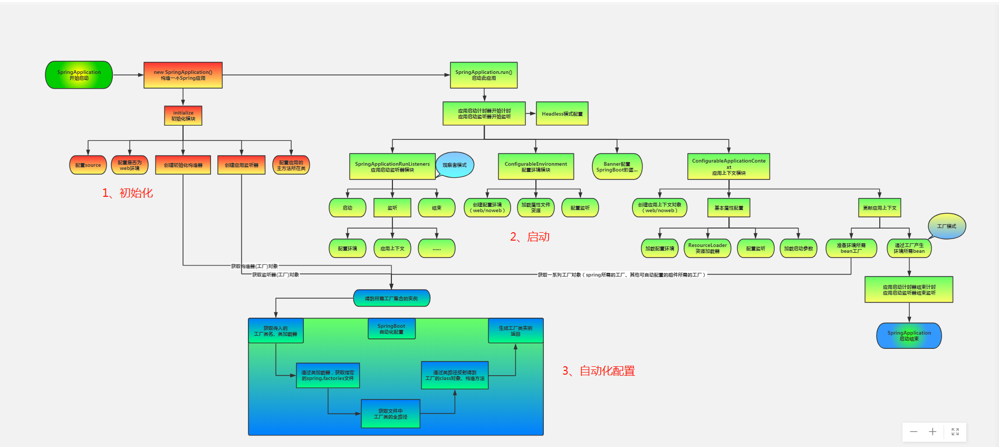

  

## springboot 启动 
1、初始化springApplication
> 1、加载初始化启动类(this.setInitializers)，通过方法this.getSpringFactoriesInstances（）从各个jar或项目中查找/META-INF/spring.factories文件中key为org.springframework.context.ApplicationContextInitializer的类，只是把这些类加载进来，还没有执行类里面的初始化方法，如下图  
> 
> 2、加载监听器（this.setListeners），通过方法this.getSpringFactoriesInstances（）从各个jar或项目中查找/META-INF/spring.factories文件中key为org.springframework.context.ApplicationListener的类  
> 
> 以上两步是组装springApplication对象的准备工作


> 3、开始实例化run监听器（这个监听器跟随springboot整个启动过程）  
> * SpringApplicationRunListeners listeners = this.getRunListeners(args);  
> * this.getRunListeners > this.getSpringFactoriesInstances(org.springframework.boot.SpringApplicationRunListener)找/META-INF/spring.factories文件中key为org.springframework.boot.SpringApplicationRunListener的类  
> * 比如appollo的配置（CustomApolloEnvInit）就是这个SpringApplicationRunListeners的子类
> * EventPublishingRunListener这个类也是SpringApplicationRunListeners的子类，这个类的作用就是代理调用第二步SpringApplication的监听器，然后调用ApplicationListener的onApplicationEvent方法
> * 如果listteners里面有多个监听器，执行的时候会多个遍历执行  

```
    package org.springframework.boot;
    public interface SpringApplicationRunListener {

        // 在run()方法开始执行时，该方法就立即被调用，可用于在初始化最早期时做一些工作
        void starting();
        // 当environment构建完成，ApplicationContext创建之前，该方法被调用
        void environmentPrepared(ConfigurableEnvironment environment);
        // 当ApplicationContext构建完成时，该方法被调用
        void contextPrepared(ConfigurableApplicationContext context);
        // 在ApplicationContext完成加载，但没有被刷新前，该方法被调用
        void contextLoaded(ConfigurableApplicationContext context);
        // 在ApplicationContext刷新并启动后，CommandLineRunners和ApplicationRunner未被调用前，该方法被调用
        void started(ConfigurableApplicationContext context);
        // 在run()方法执行完成前该方法被调用
        void running(ConfigurableApplicationContext context);
        // 当应用运行出错时该方法被调用
        void failed(ConfigurableApplicationContext context, Throwable exception);
    }
```

> 我们可以自定义SpringApplicationRunListener来监听springboot启动过程。（实现该接口，然后在/META-INF/spring.factories配置上实现类，把自定义的监听器暴露出来）

2、准备环境(this.prepareEnvironment)  
>
> * SpringApplicationRunListeners执行environmentPrepared，所以就会代理调用到一个叫做ConfigFileApplicationListener的ApplicationListener  
> * loadPostProcessors方法 org.springframework.boot.env.EnvironmentPostProcessor=\
> * 获取本地配置文件，apollo配置文件等等，详见[apollo配置环境说明图片]()  

3、绘制banner图

4、创建运用上下文


判断是不是web运用
> 能够成功加载（class.forname）这两个类private static final String[] WEB_ENVIRONMENT_CLASSES = new String[]{"javax.servlet.Servlet", "org.springframework.web.context.ConfigurableWebApplicationContext"};说明就是web服务

deduce是判断、推断的意思
> springboot启动初始化是有两个判断deduceWebEnvironment判断是否是web运用，deduceMainApplicationClass推断main方法类


  
 

##  spring boot配置内部tomcat

* springboot2.0(2018年春发布) 创建tomcat的服务器和启动tomcat服务方式与2.0之前的版本不太一样。
* SpringBoot的启动主要是通过实例化SpringApplication来启动的，启动过程主要做了以下几件事情：配置属性、获取监听器，发布应用开始启动事件、初始化输入参数、配置环境，输出banner、创建上下文、预处理上下文、刷新上下文、再刷新上下文、发布应用已经启动事件、发布应用启动完成事件。在SpringBoot中启动tomcat的工作在刷新上下文这一步。
* 而tomcat的启动主要是实例化两个组件：Connector、Container，一个tomcat实例就是一个Server，一个Server包含多个Service，也就是多个应用程序，每个Service包含多个Connector和一个Container，而一个Container下又包含多个子容器。

## spring bean

* 动态注入bean分以下几步：获取ApplicationContext;通过ApplicationContext获取到BeanFacotory;通过BeanDefinitionBuilder构建BeanDefiniton;调用beanFactory的registerBeanDefinition注入beanDefinition；使用ApplicationContext.getBean获取bean进行测试；
* 多次注入同一个bean的，如果beanName不一样的话，那么会产生两个Bean；如果beanName一样的话，后面注入的会覆盖前面的。  

```

//获取context.  
ApplicationContext ctx =  (ApplicationContext) SpringApplication.run(App.class, args);  
        
//获取BeanFactory  
DefaultListableBeanFactory defaultListableBeanFactory = (DefaultListableBeanFactory) ctx.getAutowireCapableBeanFactory();  
        
//创建bean信息.  
BeanDefinitionBuilder beanDefinitionBuilder = BeanDefinitionBuilder.genericBeanDefinition(TestService.class);  
beanDefinitionBuilder.addPropertyValue("name","张三");  
        
//动态注册bean.  
defaultListableBeanFactory.registerBeanDefinition("testService", beanDefinitionBuilder.getBeanDefinition());  
        
//获取动态注册的bean.  
TestService testService =ctx.getBean(TestService.class);

```

## 参考文献
* https://www.cnblogs.com/sword-successful/p/11383723.html（2.0版本启动内置tomcat）